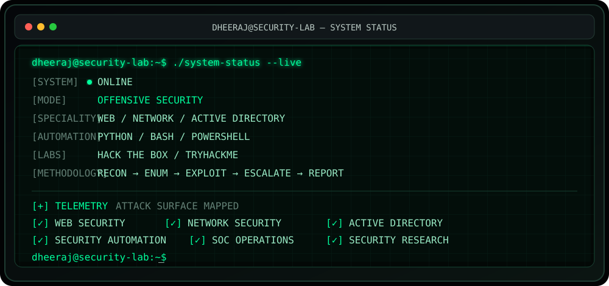

<div align="center">

# 🛡️ DHEERAJ DONEPUDI

### `OFFENSIVE SECURITY` · `PENETRATION TESTING` · `SECURITY RESEARCH`


<a href="https://dheerajportifolio.vercel.app/"></a>
<a href="https://www.linkedin.com/in/dheeraj-donepudi-320145276/"></a>
<a href="mailto:dheerajdonepudi18@gmail.com"></a>

</div>

---

## ⚡ SYSTEM STATUS

<div align="center">



</div>

> **I don't just run security tools. I focus on understanding what happens underneath them.**

---

## 🧠 ABOUT ME

Cybersecurity professional focused on **offensive security, penetration testing, security research and automation**. My work combines hands-on security testing with the ability to build Python-based tools and security-focused applications.

### 🔥 Core Areas

| Offensive Security | Enterprise / Defensive | Engineering |
|:---|:---|:---|
| Web VAPT | SOC Monitoring | Python |
| Network Pentesting | SIEM / Log Analysis | Flask |
| OWASP Top 10 | Incident Response | React |
| Active Directory | Detection Engineering | SQL |
| Privilege Escalation | Threat Analysis | Bash / PowerShell |
| Recon & Enumeration | Security Automation | REST APIs |

<details>
<summary><b>🔎 My penetration-testing workflow</b></summary>

<br>

`01 RECON` → `02 ENUMERATION` → `03 ATTACK SURFACE` → `04 VULNERABILITY ANALYSIS` → `05 EXPLOITATION` → `06 PRIVILEGE ESCALATION` → `07 POST-EXPLOITATION` → `08 EVIDENCE` → `09 REPORTING`

</details>

---

## ⚔️ SECURITY ARSENAL

<div align="center">

### 🔴 OFFENSIVE


<br><br>


### 🟦 DEFENSIVE / SOC


### 💻 BUILD / AUTOMATE


</div>

---

## 🚀 SECURITY OPERATIONS — PROJECTS

<table>
<tr>
<td width="50%" valign="top">

### 🔱 Sudarshana Chakra
**OSINT Reconnaissance Framework**

Python-based intelligence and reconnaissance framework designed to collect and correlate publicly available information.

`Python` `OSINT` `Recon` `Automation`

<a href="https://github.com/dheerajdonepudi14/Sudarshana-Chakra-Recon-Tool-">↗ VIEW REPOSITORY</a>

</td>
<td width="50%" valign="top">

### 🦅 Garuda Recon
**Reconnaissance Framework**

Security automation project focused on email/domain intelligence and reconnaissance workflows.

`Python` `OSINT` `Domain Intel` `Automation`

<a href="https://github.com/dheerajdonepudi14/Garuda-Recon-tool">↗ VIEW REPOSITORY</a>

</td>
</tr>
<tr>
<td width="50%" valign="top">

### 🛡️ Real-Time SOC Lab
**SOC / Detection Environment**

Hands-on defensive security lab covering monitoring, logs, security events and investigation workflows.

`SOC` `SIEM` `Detection` `IR`

<a href="https://github.com/dheerajdonepudi14/Real-Time-Soc-Lab-1-">↗ VIEW REPOSITORY</a>

</td>
<td width="50%" valign="top">

### 🦠 AI Malware Detection — EDR
**Deep Learning Security System**

DNN-based Windows executable malware classifier using PE features, Flask and real-time analysis.

`Python` `DNN` `PEfile` `Flask` `EDR`

**Reported accuracy: 99%**

</td>
</tr>
</table>

<details>
<summary><b>🍔 Software Engineering Project</b></summary>

### Full-Stack Food Delivery Application

A full-stack application demonstrating authentication, cart, checkout, order tracking, admin functionality, REST APIs, database design and validation.

`Flask` `React` `SQL` `REST API`

</details>

---

## 🧪 LAB / CTF ACTIVITY

<div align="center">


</div>

```text
WEB                NETWORK             WINDOWS / AD
────────────────   ────────────────    ─────────────────
Enumeration        Port Scanning       AD Enumeration
Web Exploitation   Service Analysis    Kerberoasting
SQLi / XSS         Vulnerability       Privilege Escalation
Authentication     Enumeration          Post Exploitation
```

<details>
<summary><b>🎯 Current learning path</b></summary>

<br>

**Web → Network → Linux PrivEsc → Windows PrivEsc → Active Directory → Advanced Pentesting → Security Research**

</details>

---

## 🧩 EXPERIENCE

### Cyber Security Analyst Intern — Cartel Software Pvt. Ltd. / Hacker School

`Aug 2025 — Feb 2026`

- Web application VAPT against OWASP Top 10
- SQLi, XSS, IDOR and authentication testing
- Burp Suite, Nmap, Nessus and Wireshark
- SOC monitoring and alert analysis
- Splunk and IBM QRadar
- Log analysis and event correlation
- Kali Linux and Metasploit attack simulations
- Python/Bash automation for reconnaissance, parsing and reporting

---

## 🏆 CERTIFICATIONS

<div align="center">


</div>

---

## 🎓 EDUCATION

**B.Tech — Computer Science & Engineering (Cybersecurity)**  
Vasireddy Venkatadri Institute of Technology · `2021 — 2025` · **CGPA 7.5/10**

---

## 🖥️ INTERACTIVE TERMINAL

```console
┌──(dheeraj㉿security-lab)-[~]
└─$ help

  about       → profile & security focus
  skills      → security arsenal
  projects    → security projects
  labs        → HTB / THM work
  experience  → professional experience
  certs       → certifications
  contact     → connect with me

┌──(dheeraj㉿security-lab)-[~]
└─$ ./recon --target career

[+] Initializing reconnaissance...
[+] Mapping attack surface...
[✓] Web Security
[✓] Network Security
[✓] Active Directory
[✓] Security Automation
[✓] SOC Operations
[✓] Security Research

[+] Target mapped successfully.
```

---

## 📊 LIVE GITHUB TELEMETRY

<div align="center">


<br>


</div>

---

## 🏆 ACHIEVEMENT MATRIX

<div align="center">

</div>

---

## 📈 ACTIVITY STREAM

<div align="center">

</div>

---

## 🗺️ SECURITY ROADMAP

```text
                         ┌──────────────────────┐
                         │  OFFENSIVE SECURITY  │
                         └──────────┬───────────┘
                                    │
             ┌──────────────────────┼──────────────────────┐
             ▼                      ▼                      ▼
       WEB PENTESTING         NETWORK PENTESTING      ACTIVE DIRECTORY
             │                      │                      │
             └──────────────────────┼──────────────────────┘
                                    ▼
                         PRIVILEGE ESCALATION
                                    │
                                    ▼
                           POST EXPLOITATION
                                    │
                                    ▼
                          SECURITY RESEARCH
                                    │
                                    ▼
                           ADVANCED PENTESTING
```

---

## 🔐 SECURITY PRINCIPLES

<details>
<summary><b>01 — Understand before automating</b></summary>

Automation is useful only when you understand the underlying protocol, vulnerability and expected result.

</details>

<details>
<summary><b>02 — Evidence matters</b></summary>

A vulnerability without reproducible evidence and clear impact is a weak finding.

</details>

<details>
<summary><b>03 — Think like both attacker and defender</b></summary>

Understanding detection, telemetry and response makes offensive testing more realistic.

</details>

---

## 🌐 CONNECT

<div align="center">

<a href="https://dheerajportifolio.vercel.app/"></a>
<a href="https://www.linkedin.com/in/dheeraj-donepudi-320145276/"></a>
<a href="mailto:dheerajdonepudi18@gmail.com"></a>

<br><br>


**⚔️ BUILD · BREAK · INVESTIGATE · AUTOMATE · REPEAT**

</div>
